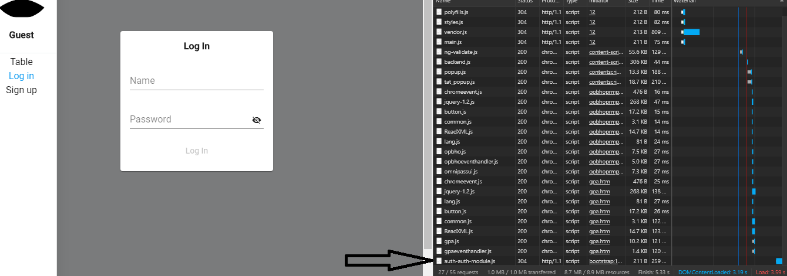
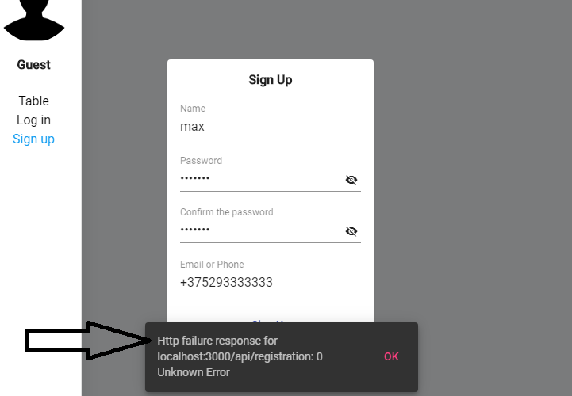
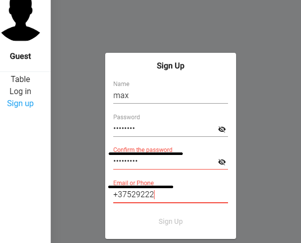
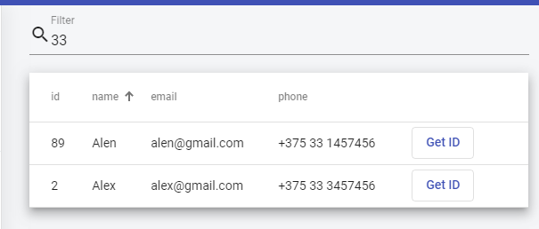
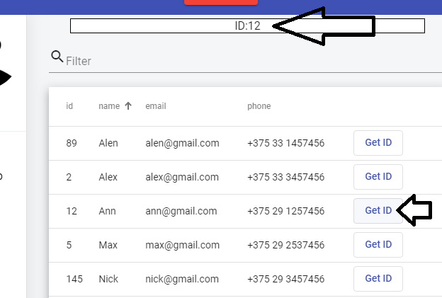
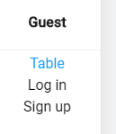

# Encata

This project was generated with [Angular CLI](https://github.com/angular/angular-cli) version 8.2.2.

ТЗ:
 * Показать знание lazy loading – должно после ng build –prod сгенерироваться больше js файлов, чем без lazy loading.

 * Сделать компонент login с валидацией полей через реактивные формы и отправкой значения из формы на адрес (localhost:3000/api/login), вывести на экран ошибку о том, что запрос не отправился.

 * Сделать компонент registration с валидацией полей через реактивные формы и отправкой значения из формы на адрес (localhost:3000/api/registration), вывести на экран ошибку о том, что запрос не отправился.

 * Сделать отдельным компонентом хедер.

 * Сделать компонент с таблицей данных, в которой реализованы фильтр по всем полям таблицы и сортировки.

 * Сделать компонент, который по кнопке переходит на другой компонент, передавая в роутере параметр (localhost:порт приложения/example/params/4). Во втором компоненте сделать отображение этого параметра на экране (второй компонент должен был children для первого в роутинге).

 * Создать menu компонент, который будет содержать ссылки на все эти компоненты.

## Development server

Run `ng serve` for a dev server. Navigate to `http://localhost:4200/`. The app will automatically reload if you change any of the source files.

## Code scaffolding

Run `ng generate component component-name` to generate a new component. You can also use `ng generate directive|pipe|service|class|guard|interface|enum|module`.

## Build

Run `ng build` to build the project. The build artifacts will be stored in the `dist/` directory. Use the `--prod` flag for a production build.
